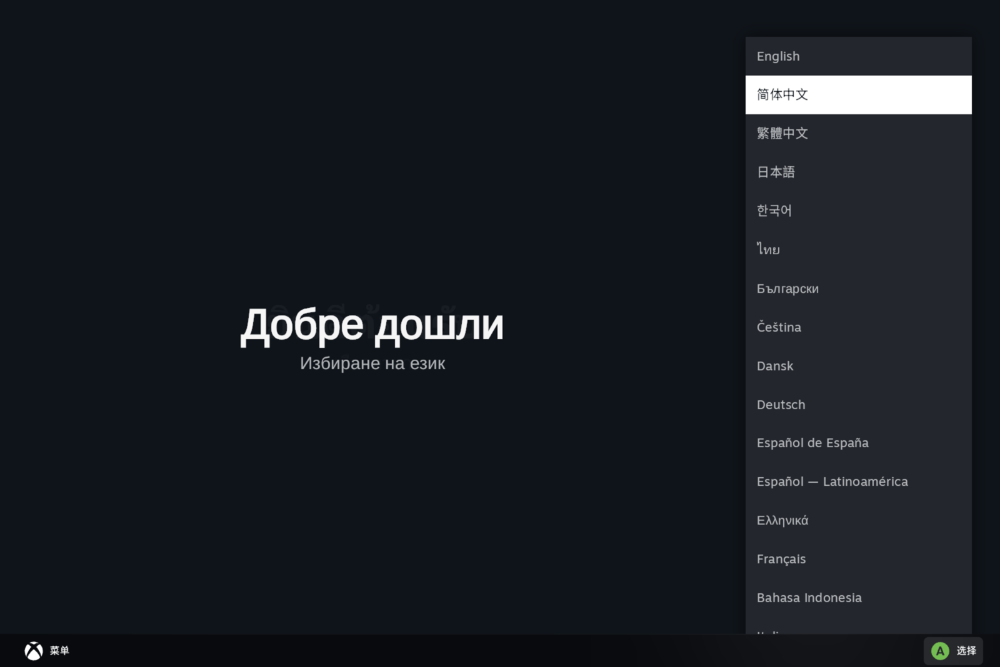
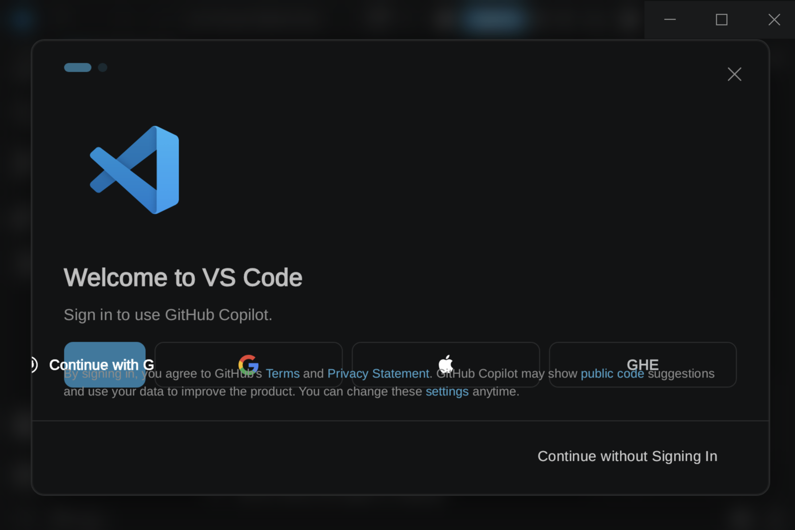

# WinPlay 安装器

在小米澎湃 OS「PC 引擎 / WinPlay」上安装任意 Windows 软件的 Android 应用。
支持 exe / msi / zip 三种安装包：自动静默安装、引擎图形安装向导、便携版解压，并一键创建桌面快捷方式（含 Steam 快捷方式）。

用 .NET 10 (net10.0-android / MAUI 非 UI 部分) 编写，APK 约 20 MB。


---

## 背景 / 原理

小米平板（Pad 6S Pro / 7 / 8 Pro 等）澎湃 OS 内置「PC 引擎」(包名 `com.xiaomi.winplay`)，是系统级 Windows 兼容层：
**Wine (experimental wow64) + FEX-Emu (x86/x64 转译 ARM64) + DXVK**。桌面上的「WPS Office PC」「CAJViewer PC」、游戏中心的 PC 游戏都运行在它之上。

但官方只开放了游戏中心入口，普通用户无法安装自己的 exe。本工具通过逆向引擎 APK 找到并复用了它的两个内部能力：

- **启动任意 exe**：向 `com.xiaomi.winplay/.WineActivity` 发送带 `app_info` 的 Intent。该参数是小米私有 Parcelable `WinAppInfo`，本工具在自己的 APK 中声明了**同全限定名**的 `com.xiaomi.winplay.bean.WinAppInfo`（`WinAppInfo.cs`），按真实 `writeToParcel` 字节序（`String exePath → Int env.size → (key,value)* → Int isUnixPath`）逐字段写入，接收方引擎会用它自己的 CREATOR 正常解包。
- **引擎官方初始化入口**：`winplay://opensteam?appid=0&devmode=1` deep link 会引导引擎完成首启初始化、组件下载与 Wine 会话创建——这是最稳定的启动路径，本工具的「Steam 一键快捷方式」即路由到它。
- **桌面快捷方式**：`ShortcutManager.RequestPinShortcut` 的 `PersistableBundle` 不允许自定义 Parcelable，因此快捷方式只携带字符串参数，由应用内透明路由 Activity (`LaunchWinActivity`) 现场拼装 Intent 转发给引擎。

## 功能

| 功能 | 说明 |
|---|---|
| ① 选择安装包 | SAF 文件选择，自动存入 `Download/`（引擎的 `D:\` 盘） |
| ② 自动安装（root 首选） | 自动嗅探安装器类型：**NSIS** (`/S`)、**MSI** (`msiexec /qn`)、未知兜底；安装前后 diff 容器内 exe 清单自动识别主程序；主程序路径带空格会自动创建无空格符号链接（解决引擎 `runNewApp` 截断 `C:\Program Files` 的 bug）；失败自动提示切 ③ |
| ③ 引擎图形安装向导 | 通过引擎 UI 会话弹出 Windows 安装向导，图形化点完即可（Inno Setup 等安装器的兼容路径） |
| ④ zip 便携版解压 | 用容器内的 7-Zip 解压到 `C:\apps\名称`，自动扫描主程序（如 VSCode） |
| ⑤⑥⑦ | 主程序路径、(手动)创建快捷方式、直接启动 |
| ⑧ 一键 Steam 快捷方式 | 零 root，路由到引擎官方 deep link，点击即启动 Steam |

### root 说明

② 自动静默安装、④ 便携解压需要 **root**（SukiSU / KernelSU），方式：以引擎数据目录 uid (`7100`) 调用引擎自带的 `wine` 执行安装器（注入引擎的 `WINEPREFIX`、`LD_LIBRARY_PATH`、`WINEDLLPATH` 环境）。应用启动时会检测 root 并引导到 SukiSU Superuser 页授权。③⑤⑥⑦⑧ 不需要 root。

## 环境要求

- 小米平板（或任意集成 PC 引擎的 HyperOS 设备）—— 在 **Xiaomi Pad 8 Pro / HyperOS 4.0.0.31 内测** 实测通过
- 至少已解锁 Bootloader（需要 root 时）
- 编译：.NET 10 SDK + `maui-android` workload + JDK 21 + Android SDK 36

## 构建

```bash
dotnet build -c Release
# 产物: bin/Release/net10.0-android/com.winplay.installer-Signed.apk
adb install -r bin/Release/net10.0-android/com.winplay.installer-Signed.apk
```

> 注意：修改源码后请 `rm -rf bin obj` 再构建（增量构建偶尔生成损坏的程序集存储，导致启动时 `UnsatisfiedLinkError`）；覆盖安装失败时先 `adb uninstall com.winplay.installer` 再装。

## 使用示例（实测截图）

**Steam**（桌面快捷方式一键启动，引擎官方入口）：


**VSCode 1.135.0 便携版**（④ zip 解压后运行——Electron 多进程在 Wine+FEX 下完整工作）：


## 已知限制 / 排坑

- 引擎的 `runNewApp` 不处理带空格的路径（会把 `C:\Program Files` 截断为 `C:\Program`）——本工具已自动建无空格符号链接，手动路径请选无空格目录
- **Inno Setup（如 VSCode 安装器）**：引擎的 wow64+FEX 无法运行其 64 位引导器（报「该版本的计算机不支持」），请走 ③ 图形向导或 zip 便携版 ④
- 引擎冷启动前若存在残留 `wineserver`/`wine` 进程，会触发引擎自身的时序 NPE（`WineWindow.client_rect` null）导致启动崩溃——启动引擎前先 `pkill wine`（工具与 README 均已记录此坑）
- MIUI「桌面快捷方式」权限需要手动设为「始终允许」（设置 → 应用 → 其他权限 → 桌面快捷方式），重装应用后会重置
- 每次卸载重装 App，SukiSU 的 root 授权需要重新添加

## 声明 / License

工具仅调用小米官方引擎的既有接口，全部本地运行，仅供学习交流，请勿用于盗版软件分发。

[MIT License](LICENSE)

## 致谢

- FEX-Emu / Wine 转译层本身
- 社区逆向资料与测试设备支持
